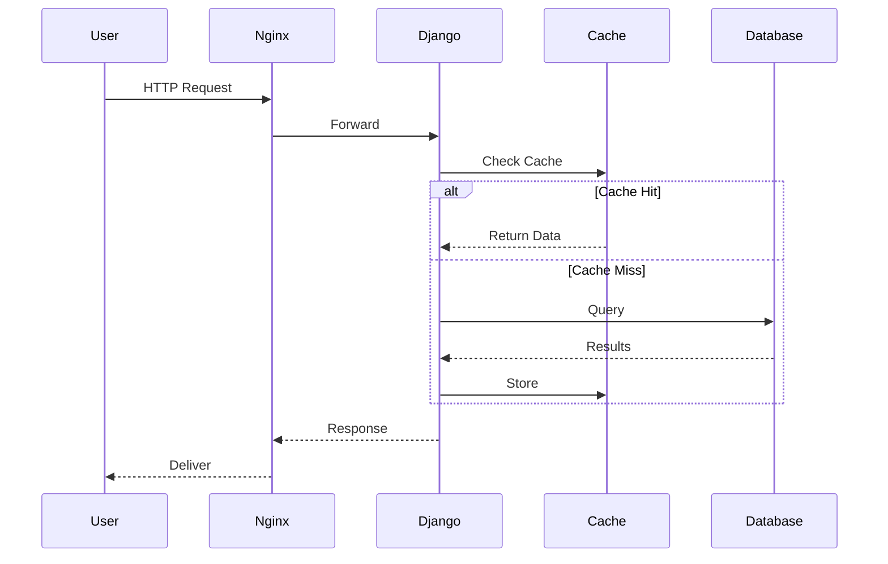

<div align="center">

# 🚀 PromptHub

**Enterprise Digital Marketplace for AI Prompts & Creative Assets**

[](LICENSE)
[](https://python.org)
[](https://djangoproject.com)
[](https://postgresql.org)
[](https://docker.com)

[Quick Start](#-quick-start) • [Features](#-key-features) • [Documentation](#-documentation) • [Contributing](#-contributing)

</div>

---

## 📖 Introduction

PromptHub is a production-ready digital marketplace platform specifically built for the AI era. It enables creators to sell AI prompts, digital products, and creative assets through a modern, scalable infrastructure.

### Why PromptHub?

**For Creators**: Monetize your AI prompts and digital products with built-in payment processing, analytics, and customer management.

**For Buyers**: Discover high-quality AI prompts across multiple categories with advanced search, ratings, and instant downloads.

**For Developers**: Fork and customize this enterprise-grade template for your own digital marketplace with complete documentation and modular architecture.

### Use Cases

- AI Prompt Marketplaces
- Digital Asset Stores
- Creative Content Platforms
- Educational Resource Libraries
- SaaS Product Catalogs

---

## ✨ Key Features

### 🛍️ Marketplace Core
- **Product Management**: Full CRUD operations with categories, tags, and versioning
- **Advanced Search**: Filter by category, price range, ratings, and popularity
- **Shopping Cart**: Session-based cart with real-time updates
- **Secure Checkout**: Integrated payment processing (Stripe-ready)
- **Order Management**: Automated fulfillment and download delivery

### 🔐 Authentication & Security
- **Multi-Auth Support**: Session auth + Token-based API authentication
- **Custom User Model**: Extended profiles with avatars and social links
- **Role-Based Access**: Permissions for customers, sellers, and administrators
- **Secure by Default**: Environment-based secrets, CSRF protection, SQL injection prevention

### 💾 Data & Performance
- **PostgreSQL Database**: ACID-compliant with optimized queries
- **Redis Caching**: Session storage and application-level caching
- **Celery Task Queue**: Async processing for emails and background jobs
- **Query Optimization**: select_related() and prefetch_related() throughout

### 🎨 Frontend & UI
- **Responsive Design**: Mobile-first with Bootstrap 5
- **24+ Modular Templates**: Reusable components for rapid development
- **Dark/Light Mode**: Built-in theme switcher
- **Interactive Elements**: Ajax-powered cart and real-time updates

### 📊 Admin Dashboard
- **Real-Time Analytics**: Sales, revenue, and user metrics
- **Product Management**: Bulk actions and CSV exports
- **User Administration**: Activity tracking and permissions
- **Content Management**: Categories, reviews, and blog posts

### 🔧 Developer Experience
- **Docker Ready**: Complete containerization with docker-compose
- **Comprehensive Docs**: 12+ documentation files
- **REST API**: Django REST Framework with token auth
- **Development Tools**: Debug toolbar, shell_plus, and automated testing

---

## 🏗️ Architecture

PromptHub follows Django's MVT (Model-View-Template) pattern with clean separation of concerns.

### System Overview

```mermaid
graph TB
    subgraph "Client Layer"
        Browser[Web Browser]
        Mobile[Mobile App]
    end
    
    subgraph "Application Layer"
        Nginx[Nginx<br/>Port 80]
        Django[Django + Gunicorn<br/>Port 8000]
        API[REST API]
    end
    
    subgraph "Data Layer"
        PostgreSQL[(PostgreSQL<br/>Port 5432)]
        Redis[(Redis<br/>Port 6379)]
    end
    
    subgraph "Task Queue"
        Celery[Celery Workers]
        Beat[Celery Beat]
    end
    
    Browser --> Nginx
    Mobile --> Nginx
    Nginx --> Django
    Django --> API
    Django --> PostgreSQL
    Django --> Redis
    Celery --> PostgreSQL
    Celery --> Redis
    Beat --> Celery
    
    style Django fill:#092E20
    style PostgreSQL fill:#336791
    style Redis fill:#DC382D
```



### Request Flow



### Technology Stack

| Layer | Technology |
|-------|-----------|
| **Backend** | Django 4.2, Python 3.11+ |
| **Database** | PostgreSQL 15+ |
| **Cache** | Redis 7+ |
| **Task Queue** | Celery |
| **Web Server** | Gunicorn + Nginx |
| **Frontend** | Bootstrap 5, jQuery |
| **API** | Django REST Framework |
| **Containers** | Docker + Docker Compose |

---

## 🚀 Quick Start

Get running in 3 minutes:

```bash
# 1. Clone repository
git clone https://github.com/phong-2107/prompthub-marketplace.git
cd prompthub-marketplace

# 2. Start with Docker
docker-compose up -d

# 3. Create admin user
docker-compose exec web python manage.py createsuperuser

# 4. Access
# 🌐 Homepage: http://localhost:8000
# 🔐 Admin: http://localhost:8000/admin
# 📊 Dashboard: http://localhost:8000/dashboard
```

**That's it!** The app is running with PostgreSQL, Redis, and Celery ready.

For detailed setup, see [START_HERE.md](START_HERE.md).

---

## 📦 Installation

### Prerequisites

- **Python 3.11+**
- **PostgreSQL 15+**
- **Redis 7+**
- **Docker & Docker Compose** (recommended)
- **Git**

### Method 1: Docker (Recommended)

```bash
# Clone and setup
git clone https://github.com/phong-2107/prompthub-marketplace.git
cd prompthub-marketplace

# Configure environment
cp .env.example .env
# Edit .env with your settings

# Start all services
docker-compose up -d

# Run migrations
docker-compose exec web python manage.py migrate

# Create superuser
docker-compose exec web python manage.py createsuperuser

# Load sample data (optional)
docker-compose exec web python seed_data.py

# Visit http://localhost:8000
```

### Method 2: Local Development

```bash
# 1. Setup virtual environment
python -m venv venv
source venv/bin/activate  # Linux/Mac
# venv\Scripts\activate  # Windows

# 2. Install dependencies
pip install -r requirements.txt

# 3. Configure PostgreSQL
createdb prompthub
createuser promptuser --pwprompt

# 4. Setup environment
cp .env.example .env
# Edit .env with database credentials

# 5. Run migrations
python manage.py migrate

# 6. Create superuser
python manage.py createsuperuser

# 7. Collect static files
python manage.py collectstatic --noinput

# 8. Run server
python manage.py runserver

# 9. Start Celery (separate terminal)
celery -A config worker -l info
celery -A config beat -l info
```

---

## ⚙️ Configuration

### Environment Variables

Copy `.env.example` to `.env`:

```bash
# Core Settings
SECRET_KEY=your-secret-key-change-in-production
DEBUG=True
DJANGO_SETTINGS_MODULE=config.settings.development

# Database
DB_NAME=prompthub
DB_USER=promptuser
DB_PASSWORD=secure_password
DB_HOST=localhost  # Use 'db' for Docker
DB_PORT=5432

# Redis
REDIS_URL=redis://localhost:6379/1
CELERY_BROKER_URL=redis://localhost:6379/0

# Email (Production)
EMAIL_HOST=smtp.gmail.com
EMAIL_PORT=587
EMAIL_HOST_USER=your-email@gmail.com
EMAIL_HOST_PASSWORD=your-app-password

# Security (Production)
ALLOWED_HOSTS=your-domain.com
SECURE_SSL_REDIRECT=True
SESSION_COOKIE_SECURE=True
```

### Settings Structure

```
config/settings/
├── base.py           # Common settings
├── development.py    # DEBUG=True
└── production.py     # DEBUG=False, security hardened
```

Switch environments:

```bash
export DJANGO_SETTINGS_MODULE=config.settings.production
```

---

## 🗂️ Folder Structure

```
prompthub-marketplace/
├── apps/                       # Django applications
│   ├── core/                   # Homepage, basic views
│   ├── prompthub/             # Marketplace logic
│   ├── users/                  # User management
│   └── api/                    # REST API endpoints
├── templates/                  # HTML templates
│   ├── marketplace/           # Public pages
│   └── dashboard/             # Admin interface
├── assets/                     # Frontend files
│   ├── css/                   # Stylesheets
│   ├── js/                    # JavaScript
│   └── images/                # Images
├── config/                     # Django configuration
│   ├── settings/              # Environment settings
│   ├── urls.py                # URL routing
│   └── celery.py              # Task queue config
├── docs/                       # Documentation
├── docker/                     # Docker configs
├── static/                     # Collected static files
├── media/                      # User uploads
├── .env.example               # Environment template
├── docker-compose.yml         # Docker services
├── manage.py                  # Django CLI
└── requirements.txt           # Dependencies
```

**Key Directories:**

| Directory | Purpose |
|-----------|---------|
| `apps/` | Modular Django apps (MVT pattern) |
| `templates/` | HTML templates with Django template language |
| `assets/` | Source CSS/JS/images |
| `config/` | Project settings and configuration |
| `docs/` | Comprehensive documentation |

See [docs/PROJECT_STRUCTURE.md](docs/PROJECT_STRUCTURE.md) for detailed structure.

---

## 🚀 Running the Project

### Development

```bash
# With Docker
docker-compose up -d

# Without Docker
python manage.py runserver

# Access
# 🌐 http://localhost:8000
# 🔐 http://localhost:8000/admin
# 📊 http://localhost:8000/dashboard
```

### Production

```bash
# Collect static files
python manage.py collectstatic --noinput

# Run with Gunicorn
gunicorn config.wsgi:application \
  --bind 0.0.0.0:8000 \
  --workers 4 \
  --timeout 120

# Or use Docker
docker-compose -f docker-compose.prod.yml up -d
```

### Common Commands

```bash
# Database
python manage.py makemigrations
python manage.py migrate
python manage.py createsuperuser

# Testing
python manage.py test
coverage run --source='.' manage.py test
coverage report

# Data
python seed_data.py  # Load sample data
python manage.py dumpdata > backup.json
python manage.py loaddata backup.json

# Celery
celery -A config worker -l info
celery -A config beat -l info
celery -A config flower  # Monitoring UI
```

### Docker Commands

```bash
# Start/Stop
docker-compose up -d
docker-compose down
docker-compose down -v  # Remove volumes

# Logs
docker-compose logs -f web
docker-compose logs -f db

# Execute commands
docker-compose exec web python manage.py migrate
docker-compose exec web python manage.py shell
docker-compose exec db psql -U postgres prompthub

# Rebuild
docker-compose up -d --build
```

---

## 🤝 Contributing

We welcome contributions! Here's how:

### Getting Started

1. **Fork** the repository on GitHub
2. **Clone** your fork: `git clone https://github.com/YOUR_USERNAME/prompthub-marketplace.git`
3. **Create branch**: `git checkout -b feature/amazing-feature`
4. **Make changes** with clean, documented code
5. **Commit**: `git commit -m "feat: add amazing feature"`
6. **Push**: `git push origin feature/amazing-feature`
7. **Open Pull Request** on GitHub

### Commit Convention

Follow [Conventional Commits](https://www.conventionalcommits.org/):

- `feat:` New feature
- `fix:` Bug fix
- `docs:` Documentation
- `refactor:` Code refactoring
- `test:` Tests
- `chore:` Maintenance

### Code Style

- Follow [PEP 8](https://pep8.org/)
- Use [Black](https://github.com/psf/black) formatter
- Write docstrings for functions/classes
- Add type hints where applicable
- Write tests for new features

### Pull Request Checklist

- [ ] Code follows style guidelines
- [ ] Tests pass: `python manage.py test`
- [ ] New features include tests
- [ ] Documentation updated
- [ ] No merge conflicts

---

## 📄 License

This project is licensed under the **MIT License**.

```
MIT License

Copyright (c) 2026 PromptHub

Permission is hereby granted, free of charge, to any person obtaining a copy
of this software and associated documentation files (the "Software"), to deal
in the Software without restriction, including without limitation the rights
to use, copy, modify, merge, publish, distribute, sublicense, and/or sell
copies of the Software, subject to the following conditions:

The above copyright notice and this permission notice shall be included in all
copies or substantial portions of the Software.

THE SOFTWARE IS PROVIDED "AS IS", WITHOUT WARRANTY OF ANY KIND, EXPRESS OR
IMPLIED, INCLUDING BUT NOT LIMITED TO THE WARRANTIES OF MERCHANTABILITY,
FITNESS FOR A PARTICULAR PURPOSE AND NONINFRINGEMENT.
```

---

## 🗺️ Roadmap

### ✅ Phase 1: Foundation (Q4 2025 - Completed)
- [x] Core architecture and setup
- [x] User authentication
- [x] Database models
- [x] Admin dashboard
- [x] Marketplace homepage
- [x] Docker containerization

### 🚧 Phase 2: Commerce (Q1 2026 - In Progress)
- [x] Product CRUD operations
- [ ] Shopping cart & checkout
- [ ] Payment integration (Stripe)
- [ ] Order management
- [ ] Email notifications

### 📅 Phase 3: Advanced Features (Q2 2026)
- [ ] Reviews & ratings
- [ ] Advanced search (Elasticsearch)
- [ ] Recommendations engine
- [ ] Wishlist functionality
- [ ] Social sharing

### 📅 Phase 4: Mobile & API (Q2-Q3 2026)
- [ ] Complete REST API docs
- [ ] GraphQL API
- [ ] PWA support
- [ ] Mobile app (React Native)

### 📅 Phase 5: Enterprise (Q3-Q4 2026)
- [ ] Multi-vendor support
- [ ] Subscription plans
- [ ] Advanced analytics
- [ ] White-label options
- [ ] ML recommendations

### 📅 Phase 6: AI Integration (2027)
- [ ] AI-powered search
- [ ] Chatbot support
- [ ] Automated moderation
- [ ] Smart pricing

See [docs/ROADMAP.md](docs/ROADMAP.md) for detailed timeline.

---

## 📚 Documentation

### Quick Start
- **[START_HERE.md](START_HERE.md)** - New to the project? Start here
- **[QUICKSTART.md](QUICKSTART.md)** - Detailed setup guide
- **[COMMANDS_CHEATSHEET.md](COMMANDS_CHEATSHEET.md)** - Command reference

### Technical Docs
- **[docs/DATABASE_GUIDE.md](docs/DATABASE_GUIDE.md)** - PostgreSQL & ORM
- **[docs/DASHBOARD_SYSTEM.md](docs/DASHBOARD_SYSTEM.md)** - Admin dashboard
- **[docs/PROJECT_STRUCTURE.md](docs/PROJECT_STRUCTURE.md)** - Folder structure
- **[docs/VISUAL_GUIDE.md](docs/VISUAL_GUIDE.md)** - Architecture diagrams
- **[docs/ROADMAP.md](docs/ROADMAP.md)** - Development plan

### Complete Index
**[DOCS_INDEX.md](DOCS_INDEX.md)** - Central documentation hub

---

## 📞 Support

- **📖 Documentation**: [docs/](docs/)
- **🐛 Issues**: [GitHub Issues](https://github.com/phong-2107/prompthub-marketplace/issues)
- **💬 Discussions**: [GitHub Discussions](https://github.com/phong-2107/prompthub-marketplace/discussions)

---

## 🙏 Acknowledgments

Special thanks to:
- **Django Team** - Amazing web framework
- **PostgreSQL Community** - Robust database
- **Bootstrap Team** - Beautiful UI framework
- **Open Source Contributors** - All the wonderful libraries

---

<div align="center">

**[⭐ Star this repo](https://github.com/phong-2107/prompthub-marketplace)** if you find it helpful!

Built with ❤️ by the PromptHub Team

[Website](https://www.prompthub.com) • [Documentation](docs/) • [GitHub](https://github.com/phong-2107/prompthub-marketplace)

</div>
